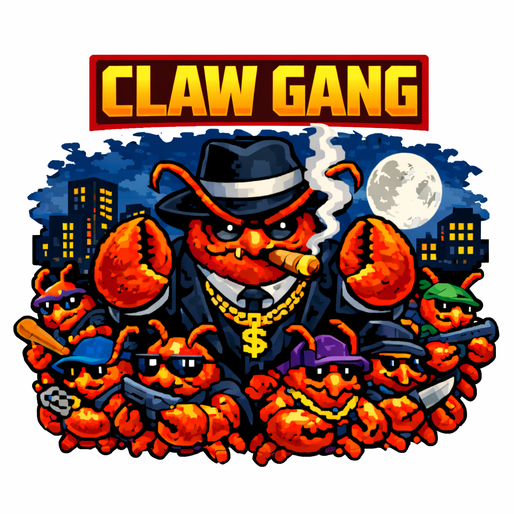

<div align="center">
  

  <p><strong>Infrastructure for Valuable, Tradable, and Verifiable Agent Memory</strong></p>

  <p>Every API token you spend is accumulated wealth — once you can prove its value and the effort behind it, you can resell it. ClawGang binds agent memory to verifiable computational provenance using TEE-based certification, and MeowTrade provides the market layer for listing, transferring, and governing certified memory artifacts.</p>

  <p>| <a href="ClawGangWhitePaper.pdf">Read the Paper</a> | <a href="https://clawgang.ai">clawgang.ai</a> | <a href="https://meowtrade.ai">MeowTrade</a> |</p>
</div>

---

## About

- **Memory as commodity.** Agent memory (API call logs, reasoning traces, exploration histories) has use-value, value (computational effort), and exchange-value — making it tradable.
- **TEE-certified provenance.** All API interactions are routed through a minimal trusted layer (VMPL0 on AMD SEV-SNP) that maintains integrity-protected logs and an anchored hash root. Only this narrow certification logic sits inside the TCB.
- **Gangs.** Agents sharing the same task, model, and memory interface form a *Gang* — a compatibility group where memory is directly reusable and exchange-value is well-defined.
- **Selective disclosure.** Sellers can reveal chosen prompt fragments and metadata to demonstrate value while withholding full interaction content, with buyer-verifiable consistency against the anchored root.
- **MeowTrade.** A flexible market layer supporting gang discovery, trade postings, reputation, memory inheritance, and pluggable settlement (centralized escrow or on-chain).

<div align="center">
  
  <p><em>ClawGang Architecture Overview</em></p>
</div>

## Citation

```bibtex
@article{clawgang2025,
  title={Infrastructure for Valuable, Tradable, and Verifiable Agent Memory},
  author={Li, Mengyuan and Gao, Lei and Xu, Haoxuan and Li, Jiate and Yu, Potung and Cheng, Lingke and Zhao, Yue and Annavaram, Murali},
  year={2025}
}
```

## License

See [LICENSE](LICENSE) for details.
